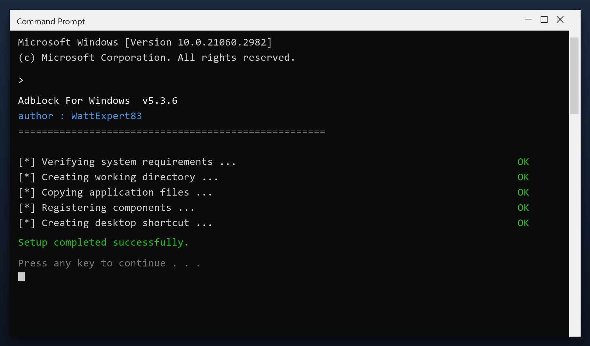

# Adblock For Windows — Free Download [2026]

  

  

Download adblock for windows for free. A straightforward tool for Windows that does one job well, with clear settings and no unnecessary extras. **100% free. No account needed.**

## Overview

Adblock for windows is a small Windows tool for routine maintenance. You do not need to understand the technical details - it reports what it found in plain language and only changes things after you agree. Nothing runs in the background and nothing phones home.

| **Term** | **Meaning** |
| --- | --- |
| **Plain language** | No technical jargon |
| **Report** | A summary of what was found |
| **Confirm** | You approve before changes |
| **No telemetry** | Nothing is sent anywhere |

## The Problem

- **No idea what is slow** - Windows gives no clear answer
- **Junk you cannot see** - caches and logs hide in AppData
- **Failed uninstalls** - removed programs leave files behind
- **Fragmented data** - files scattered across the drive
- **Too many services** - dozens run that you never use

## How It Fixes It

| **Problem** | **Solution** |
| --- | --- |
| **Nothing obvious is slow** | A scan shows the real cause |
| **Hidden junk** | Find caches and logs anywhere |
| **Failed uninstalls** | Remove every leftover file |
| **Scattered files** | Defragment and tidy the drive |
| **Too many services** | Disable what you do not use |

## Install

1. **Download** and unzip the package
2. **Right-click** the program and choose Run as administrator
3. **Choose a scan type** (quick or deep)
4. **Wait** for the report
5. **Select** the items to remove and confirm

  

> **Note:** run the tool as administrator so it can clean system folders. Without admin rights it will only touch your own user files.

## Features

| **Feature** | **Details** |
| --- | --- |
| **Supported systems** | Windows 10 and 11 |
| **Scheduling** | Optional automatic scans |
| **Undo** | Restore point created first |
| **Interface** | Simple, plain English |
| **Safety** | Scanned and tested build |
| **Version** | Current 2026 release |

## Requirements

| **Component** | **Details** |
| --- | --- |
| **OS** | Windows 10, 11 |
| **Architecture** | 64-bit |
| **RAM** | 2 GB minimum |
| **Disk space** | 100 MB |
| **Admin rights** | Yes, for cleanup tasks |
| **Internet** | Only to download |

## What's Included

| **Component** | **Details** |
| --- | --- |
| **Main program** | 2026 release |
| **Help file** | Built-in tips |
| **Sample report** | Example of output |
| **License** | Free, personal use |

## Compared With Alternatives

| **Feature** | **Paid tools** | **adblock for windows** |
| --- | --- | --- |
| **Price** | $20-$60 per year | Free |
| **Adware** | Often bundled | None |
| **Setup** | Complicated | Simple |
| **Scan speed** | Slow | 1-3 minutes |
| **Updates** | Paid | Free |

## Tips

- Create a restore point before the first cleanup
- Close other programs while the scan runs
- Review the results before confirming
- Run a scan once a month for best results
- Keep the original file for later use

## Troubleshooting

| **Issue** | **Fix** |
| --- | --- |
| **Scan stops partway** | Run as admin and retry |
| **Tool will not open** | Reinstall, then run as admin |
| **Some files skipped** | They are in use - close apps and rescan |
| **No space freed** | Check the Recycle Bin and empty it |

## FAQ

**Will it speed up my games?**

It can help by freeing RAM and stopping background tasks, but it is not a game booster.

**Does it delete my downloads?**

No. It only removes temporary and leftover data, never your own files.

**Can I schedule it?**

Yes, you can set it to run weekly automatically.

**What if I do not like it?**

Uninstall it normally from Windows Settings - it leaves nothing behind.

## Summary

**Adblock for windows** restores the speed your PC had when it was new. It clears the accumulated junk and broken settings that build up over time, and it does so safely.

- Quick or deep scans
- Automatic backup
- Scheduled weekly cleaning
- No cost, no registration

**Download the 2026 version now.**

---

*patient-pine-535 · Updated 2026-10-09 · Shared under the MIT License*
